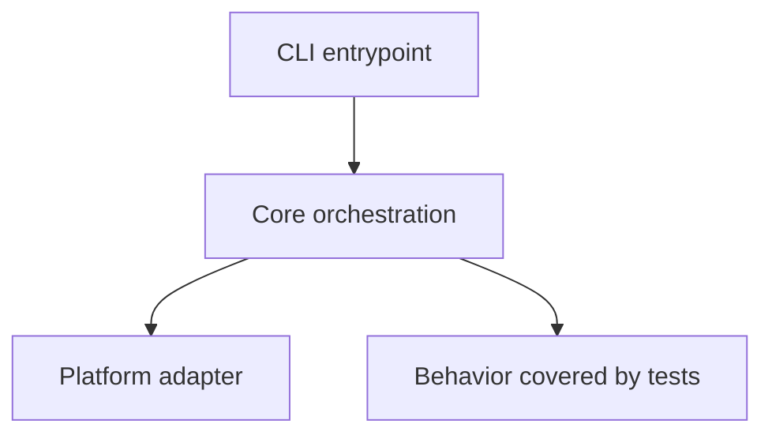
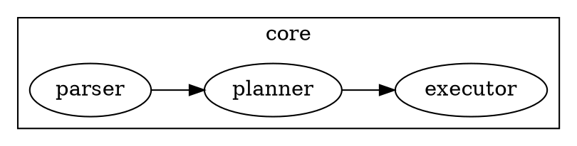

# Repo Wiki

## Overview

Create a large, accurate, well-structured Markdown wiki that teaches a repository to code learners and new maintainers. Prefer evidence from files over guesses, cover the whole repository at useful granularity, and explain core code, decisions, algorithms, and tradeoffs in dedicated sections.

## Operating Principles

- Read the repository as a system, not as isolated files.
- Optimize for a newcomer who needs both orientation and maintainer-level depth.
- Be exhaustive in coverage but selective in depth: explain important, surprising, or risky code paths deeply; summarize boilerplate and generated code briefly.
- Ground claims in concrete file paths, symbols, config names, scripts, tests, and observed behavior.
- Mark uncertainty explicitly when evidence is incomplete.
- Prefer Markdown that can stand alone as a durable wiki page or `docs/wiki.md`.
- Use Mermaid, Graphviz, and KaTeX only when they clarify architecture, data flow, state machines, dependency graphs, or algorithms.

## Standard Workflow

### 1. Establish Scope and Output Target

Confirm or infer:

- Repository root and any subdirectory scope.
- Output destination: inline Markdown, a new wiki file, or updates to existing docs.
- Desired depth, language, and audience if the user specifies them.

If not specified, produce one comprehensive Markdown document aimed at repository learners and new maintainers.

### 2. Create a Repository Map

Use fast local inspection before detailed reading. Prefer `rg --files`, `find`, and language-native metadata commands. Run `scripts/repo_snapshot.js` with Node when useful to generate a structured inventory without loading every file into context.

Recommended first pass:

```bash
node <skill_dir>/scripts/repo_snapshot.js <repo_root> --output /tmp/repo-snapshot.md
```

Inspect at least:

- Root documentation: `README*`, `CONTRIBUTING*`, `CHANGELOG*`, `LICENSE*`, `docs/`, `wiki/`.
- Package and build metadata: `package.json`, `pnpm-workspace.yaml`, `Cargo.toml`, `go.mod`, `pyproject.toml`, `requirements*.txt`, `pom.xml`, `build.gradle`, `Makefile`, CI configs.
- Source roots: `src/`, `lib/`, `app/`, `packages/`, `crates/`, `cmd/`, `internal/`, `pkg/`, `tests/`, `examples/`.
- Configuration: bundlers, linters, formatters, test runners, codegen, deployment, Docker, environment examples.
- Generated, vendored, lock, build, and cache directories; identify but do not deeply read unless relevant.

### 3. Build a Mental Model

Derive and record:

- The repository's purpose and primary user/developer workflows.
- Main entry points and executable surfaces.
- Module boundaries and ownership of responsibilities.
- Data flow, control flow, lifecycle, request/command paths, and extension points.
- External dependencies and integrations.
- Test strategy and quality gates.
- Release, packaging, deployment, or publishing process.

Use a short scratch outline before writing the final wiki so coverage is deliberate.

### 4. Read Deeply by Importance

Prioritize detailed reading in this order:

1. Public APIs, entry points, CLI commands, server routes, plugin hooks, exported packages.
2. Core domain modules and orchestration code.
3. Algorithms, parsers, compilers, schedulers, state machines, caching, concurrency, security, persistence, network boundaries, and error handling.
4. Tests that reveal expected behavior and edge cases.
5. Build, CI, release, and developer tooling.
6. Examples, fixtures, migrations, generated artifacts, and legacy code.

For each important subsystem, identify:

- Key files and symbols.
- Responsibilities and boundaries.
- Inputs, outputs, side effects, and invariants.
- Happy paths and failure paths.
- Design tradeoffs and likely reasons for the shape of the code.
- Tests or missing tests.
- Maintenance hazards and safe modification points.

### 5. Write the Wiki

Use the outline in `references/wiki_structure.md` as the default document framework. Adapt headings to the repository instead of forcing irrelevant sections.

The wiki should normally include:

- Title, audience, and reading guide.
- Executive summary.
- Repository map and directory tour.
- Quickstart for local development.
- Architecture overview with diagrams.
- Deep dives for core subsystems.
- Important algorithms and data structures.
- Configuration, build, test, release, and operations guide.
- Maintainer playbook with common change recipes.
- Troubleshooting and risk areas.
- Glossary and symbol/file index.

### 6. Verify Coverage and Accuracy

Before finalizing, check:

- Every top-level directory is either explained or explicitly marked as generated/vendor/cache/irrelevant.
- Every major package/module has at least a short purpose statement.
- Core entry points and execution paths are traced end-to-end.
- Claims about behavior are supported by code, tests, config, or docs.
- Diagrams match the written explanation.
- Mermaid/Graphviz/KaTeX blocks are syntactically plausible.
- The document has clear heading hierarchy and usable navigation.
- The wiki distinguishes facts from inferences.

## Diagrams and Math

Use diagrams sparingly but concretely.

### Mermaid

Use Mermaid for architecture, sequence, flow, state, and dependency diagrams:

```markdown

```

### Graphviz

Use Graphviz DOT when graph layout or clustered dependency visualization is clearer than Mermaid:

```markdown

```

### KaTeX

Use KaTeX for formulas, complexity, scoring, or algorithmic invariants:

```markdown
The cache hit ratio is $H = \frac{hits}{hits + misses}$, and the lookup path is expected $O(1)$ under normal hash distribution.
```

## Output Quality Bar

A strong repo wiki:

- Lets a newcomer explain what the repository does after the first two sections.
- Lets a new maintainer find where to make common changes.
- Explains why important code is structured as it is, not only what files exist.
- Calls out non-obvious coupling, invariants, and edge cases.
- Includes enough file/symbol references to support navigation.
- Avoids dumping raw file trees without interpretation.
- Avoids hallucinated architecture: if unsure, say what evidence suggests and what remains unknown.

## Using Bundled Resources

- Use `scripts/repo_snapshot.js` with Node to produce a repository inventory, language/config summary, and candidate reading plan.
- Read `references/wiki_structure.md` when drafting or reviewing the final wiki outline.
