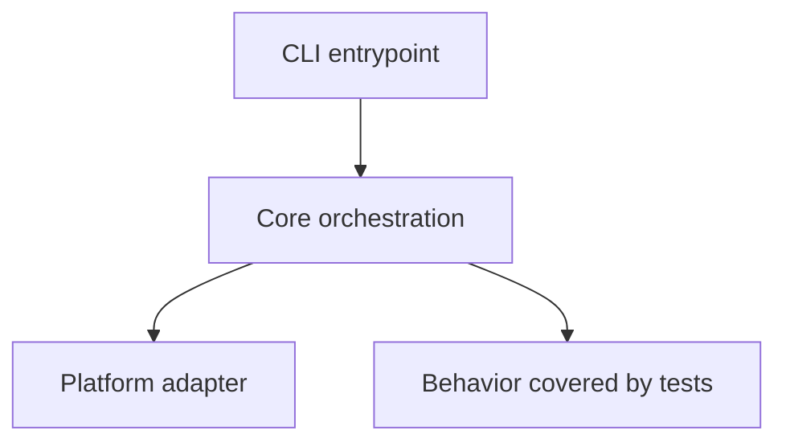
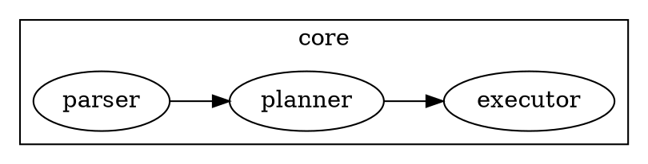

# Repo Wiki

## Overview

Create a large, accurate, multi-page Markdown wiki directory for a substantial repository. This skill is optimized for codebases large enough to create maintainer pressure: monorepos, frameworks, compilers, platforms, services, or products with hundreds of thousands of lines of code. Prefer evidence from files over guesses, cover the whole repository at useful granularity, and explain core code, decisions, algorithms, and tradeoffs in dedicated pages.

## Operating Principles

- Produce a **wiki directory**, not a single giant Markdown file, unless the user explicitly asks for one file.
- Default output directory: `docs/wiki/`.
- Read the repository as a system, not as isolated files.
- Optimize for maintainers and code learners who need to navigate a large, stressful codebase.
- Be exhaustive in coverage but selective in depth: explain important, surprising, or risky code paths deeply; summarize boilerplate and generated code briefly.
- Ground claims in concrete file paths, symbols, config names, scripts, tests, and observed behavior.
- Mark uncertainty explicitly when evidence is incomplete.
- Use Mermaid, Graphviz, and KaTeX only when they clarify architecture, data flow, state machines, dependency graphs, or algorithms.

## Standard Workflow

### 1. Establish Scope and Output Target

Confirm or infer:

- Repository root and any subdirectory scope.
- Output directory. If not specified, create `docs/wiki/`.
- Desired language and audience if the user specifies them.

If not specified, produce a multi-page wiki directory aimed at repository learners and new maintainers.

### 2. Create a Repository Map

Use fast local inspection before detailed reading. Prefer `rg --files`, `find`, and language-native metadata commands. Run `scripts/repo_snapshot.js` with Node when useful to generate a structured inventory without loading every file into context.

Recommended first pass:

```bash
node <skill_dir>/scripts/repo_snapshot.js <repo_root> --output /tmp/repo-snapshot.md
```

Inspect at least:

- Root documentation: `README*`, `CONTRIBUTING*`, `CHANGELOG*`, `LICENSE*`, `docs/`, `wiki/`.
- Package and build metadata: `package.json`, `pnpm-workspace.yaml`, `Cargo.toml`, `go.mod`, `pyproject.toml`, `requirements*.txt`, `pom.xml`, `build.gradle`, `Makefile`, CI configs.
- Source roots: `src/`, `lib/`, `app/`, `packages/`, `crates/`, `cmd/`, `internal/`, `pkg/`, `tests/`, `examples/`.
- Configuration: bundlers, linters, formatters, test runners, codegen, deployment, Docker, environment examples.
- Generated, vendored, lock, build, and cache directories; identify but do not deeply read unless relevant.

### 3. Build a Wiki Plan

Before writing pages, create a short plan for the wiki directory:

- `index.md`: navigation hub, audience, reading order, executive summary.
- `repository-map.md`: top-level directory and package tour.
- `architecture/`: architecture overview and major runtime flows.
- `modules/`: module, package, or directory deep dives; use one file only for simple modules, and use subdirectories with multiple pages for complex modules.
- `subsystems/`: core domain, algorithm, state, persistence, network, security, plugin, or compiler subsystems; use one file only for simple subsystems, and use subdirectories with multiple pages for complex subsystems.
- `development/`: setup, build, test, lint, debug, release, CI, and operations.
- `maintainer-playbook.md`: common change recipes, safe edit points, risks, troubleshooting.
- `reference/`: glossary, file index, symbol index, open questions.

Adapt this structure to the repository, but keep the output multi-page and navigable.

### 4. Read Deeply by Importance

Prioritize detailed reading in this order:

1. Public APIs, entry points, CLI commands, server routes, plugin hooks, exported packages.
2. Core domain modules and orchestration code.
3. Algorithms, parsers, compilers, schedulers, state machines, caching, concurrency, security, persistence, network boundaries, and error handling.
4. Tests that reveal expected behavior and edge cases.
5. Build, CI, release, and developer tooling.
6. Examples, fixtures, migrations, generated artifacts, and legacy code.

For each important subsystem, identify:

- Key files and symbols.
- Responsibilities and boundaries.
- Inputs, outputs, side effects, and invariants.
- Happy paths and failure paths.
- Design tradeoffs and likely reasons for the shape of the code.
- Tests or missing tests.
- Maintenance hazards and safe modification points.

### 5. Write the Wiki Directory

Use the outline in `references/wiki_structure.md` as the default directory framework. Adapt file names and headings to the repository instead of forcing irrelevant sections.

The wiki directory should normally include:

- A root `index.md` with a complete page index and recommended reading paths.
- Repository map and directory tour.
- Quickstart for local development.
- Architecture overview with diagrams.
- End-to-end execution path pages.
- Module/package/directory deep-dive pages or subdirectories.
- Core subsystem pages or subdirectories.
- Important algorithms, data structures, and invariants.
- Configuration, build, test, release, and operations pages.
- Maintainer playbook with common change recipes.
- Troubleshooting, glossary, file index, symbol index, and open questions.

### Minimum Size and Structure Targets

Do not produce a short overview. This skill is for large codebases where maintainers need serious documentation. Use these deliberately high empirical minimums across the **entire wiki directory**; they are meant to force breadth and depth rather than a polished summary:

| Profile | Typical trigger | Minimum target |
| --- | --- | --- |
| Large | substantial application/library, tens of thousands of LOC | 30+ Markdown files, 250,000+ words, 15,000+ non-blank lines, 1,200+ headings, 1,800+ file references |
| Huge | hundreds of thousands of LOC, monorepo/platform/framework | 80+ Markdown files, 600,000+ words, 35,000+ non-blank lines, 2,600+ headings, 4,500+ file references |
| Massive | very large monorepo or multi-product system | 150+ Markdown files, 1,200,000+ words, 70,000+ non-blank lines, 5,200+ headings, 9,000+ file references |

For an unknown repository, default to the **huge** target. For every substantial top-level directory, create or include a dedicated section/page. For every complex module or core subsystem, prefer a subdirectory with multiple focused pages over one overlong page. Include key files/symbols, how it works, tests, failure modes, and maintainer notes. Prefer adding missing pages and evidence-backed explanations over padding generic prose.

### 6. Verify Coverage and Accuracy

Before finalizing, check:

- A wiki directory exists, not only one Markdown file.
- `index.md` links to every major wiki page.
- Every top-level directory is either explained or explicitly marked as generated/vendor/cache/irrelevant.
- Every major package/module has at least a short purpose statement.
- Core entry points and execution paths are traced end-to-end.
- Claims about behavior are supported by code, tests, config, or docs.
- Diagrams match the written explanation.
- Mermaid/Graphviz/KaTeX blocks are syntactically plausible.
- The wiki distinguishes facts from inferences.

Run the Node quality gate on the wiki directory and expand the wiki if it fails:

```bash
node <skill_dir>/scripts/wiki_quality_check.js <wiki_dir> --profile huge
```

Use `--profile large` only for smaller repositories, and `--profile massive` for very large monorepos or multi-product systems. The checker enforces minimum Markdown file count, word count, non-blank lines, headings, H2 sections, file references, fenced code blocks, and tables.

## Diagrams and Math

Use diagrams sparingly but concretely.

### Mermaid

Use Mermaid for architecture, sequence, flow, state, and dependency diagrams:

```markdown

```

### Graphviz

Use Graphviz DOT when graph layout or clustered dependency visualization is clearer than Mermaid:

```markdown

```

### KaTeX

Use KaTeX for formulas, complexity, scoring, or algorithmic invariants:

```markdown
The cache hit ratio is $H = \frac{hits}{hits + misses}$, and the lookup path is expected $O(1)$ under normal hash distribution.
```

## Output Quality Bar

A strong repo wiki directory:

- Lets a newcomer explain what the repository does after reading `index.md` and the architecture overview.
- Lets a maintainer find the right page for common changes without scanning a huge single document.
- Explains why important code is structured as it is, not only what files exist.
- Calls out non-obvious coupling, invariants, and edge cases.
- Includes enough file/symbol references to support navigation.
- Meets or exceeds the applicable minimum size and structure target without filler.
- Avoids dumping raw file trees without interpretation.
- Avoids hallucinated architecture: if unsure, say what evidence suggests and what remains unknown.

## Using Bundled Resources

- Use `scripts/repo_snapshot.js` with Node to produce a repository inventory, language/config summary, and candidate reading plan.
- Use `scripts/wiki_quality_check.js` with Node to verify that a generated wiki directory is not too small or under-structured.
- Read `references/wiki_structure.md` when drafting or reviewing the final wiki directory outline.
