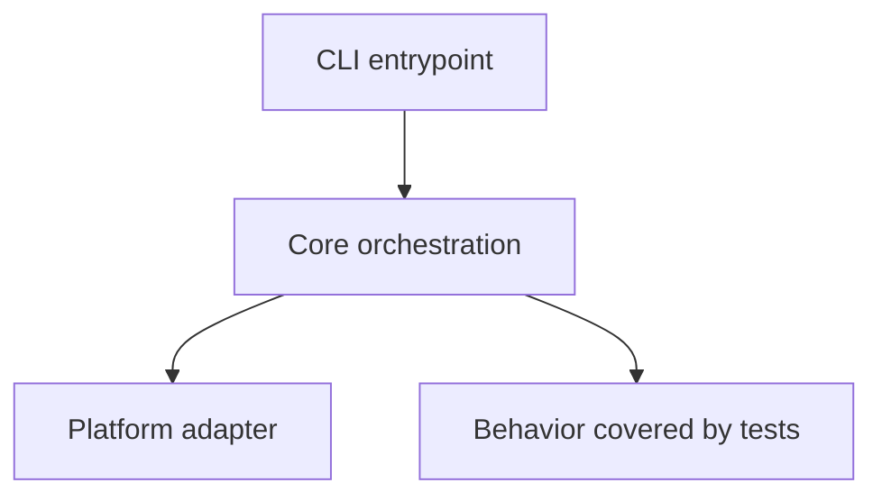
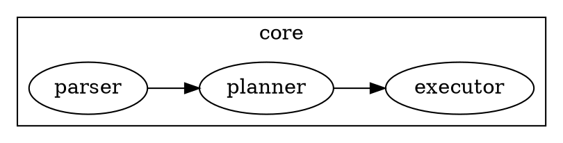

# Repo Wiki

## Overview

Create a large, accurate, multi-page Markdown wiki directory for a substantial repository. This skill is optimized for codebases large enough to create maintainer pressure: monorepos, frameworks, compilers, platforms, services, or products with hundreds of thousands of lines of code. Prefer evidence from files over guesses, cover the whole repository at useful granularity, and explain core code, decisions, algorithms, and tradeoffs in dedicated pages.

## Operating Principles

- Produce a **wiki directory**, not a single giant Markdown file, unless the user explicitly asks for one file.
- Default output directory: `docs/wiki/`.
- Read the repository as a system, not as isolated files.
- Optimize for maintainers and code learners who need to navigate a large, stressful codebase.
- Be exhaustive in coverage but selective in depth: explain important, surprising, or risky code paths deeply; summarize boilerplate and generated code briefly.
- Ground claims in concrete file paths, symbols, config names, scripts, tests, and observed behavior.
- Mark uncertainty explicitly when evidence is incomplete.
- Use Mermaid and KaTeX when they clarify architecture, data flow, state machines, dependency graphs, or algorithms. Prefer Mermaid for diagrams in plain wiki output. Use Graphviz (DOT) only when the user explicitly requests a documentation site, since it requires a build-time plugin to render.
- Treat numeric size targets as a floor, not the goal. Passing the quality checker is necessary but never sufficient; do not write repetitive, template-heavy, file-index-dominated, or count-driven prose.
- Do not bulk-generate a wiki from file names alone. Use scripts for inventory and quality checks, but write architecture, subsystem, algorithm, and maintainer guidance from actual source reading and design reasoning.
- Scripts may scaffold navigation and inventories, but they must not author the core explanatory prose. Manually synthesize the architecture pages from source evidence before producing broad generated support pages.
- Treat documentation-site deployment as optional. If the user asks to publish the wiki as an Rspress/docs site, read `references/rspress_docs_site.md`; otherwise do not include site setup in the main workflow.

## Standard Workflow

### 1. Establish Scope and Output Target

Confirm or infer:

- Repository root and any subdirectory scope.
- Output directory. If not specified, create `docs/wiki/`.
- Desired language and audience if the user specifies them.

If not specified, produce a multi-page wiki directory aimed at repository learners and new maintainers.

### 2. Create a Repository Map

Use fast local inspection before detailed reading. Prefer `rg --files`, `find`, and language-native metadata commands. Run `scripts/repo_snapshot.js` with Node when useful to generate a structured inventory without loading every file into context.

Recommended first pass:

```bash
node <skill_dir>/scripts/repo_snapshot.js <repo_root> --output /tmp/repo-snapshot.md
```

Inspect at least:

- Root documentation: `README*`, `CONTRIBUTING*`, `CHANGELOG*`, `LICENSE*`, `docs/`, `wiki/`.
- Package and build metadata: `package.json`, `pnpm-workspace.yaml`, `Cargo.toml`, `go.mod`, `pyproject.toml`, `requirements*.txt`, `pom.xml`, `build.gradle`, `Makefile`, CI configs.
- Source roots: `src/`, `lib/`, `app/`, `packages/`, `crates/`, `cmd/`, `internal/`, `pkg/`, `tests/`, `examples/`.
- Configuration: bundlers, linters, formatters, test runners, codegen, deployment, Docker, environment examples.
- Generated, vendored, lock, build, and cache directories; identify but do not deeply read unless relevant.

### 3. Build a Wiki Plan

Before writing pages, create a short plan for the wiki directory:

- `index.md`: navigation hub, audience, reading order, executive summary.
- `repository-map.md`: top-level directory and package tour.
- `architecture/`: architecture overview and major runtime flows.
- `modules/`: module, package, or directory deep dives; use one file only for simple modules, and use subdirectories with multiple pages for complex modules.
- `subsystems/`: core domain, algorithm, state, persistence, network, security, plugin, or compiler subsystems; use one file only for simple subsystems, and use subdirectories with multiple pages for complex subsystems.
- `development/`: setup, build, test, lint, debug, release, CI, and operations.
- `maintainer-playbook.md`: common change recipes, safe edit points, risks, troubleshooting.
- `reference/`: glossary, file index, symbol index, open questions.

Adapt this structure to the repository, but keep the output multi-page and navigable.

Before bulk writing, identify the repository's actual design centers: the primary runtime path, the core data model, boundary interfaces, configuration model, persistence/cache/network layers, extension points, and tests that define behavior. Turn those into named architecture or subsystem pages first. File indexes and module catalogs come later and must not dominate the wiki.

Create and keep a short `analysis-plan.md` or equivalent scratch outline while working. It should list the design centers, the source files already read for each one, the main hypotheses, and which wiki pages will explain them. Delete or omit this scratch file from the final wiki unless the user wants process notes.

### 4. Read Deeply by Importance

Prioritize detailed reading in this order:

1. Public APIs, entry points, CLI commands, server routes, plugin hooks, exported packages.
2. Core domain modules and orchestration code.
3. Algorithms, parsers, compilers, schedulers, state machines, caching, concurrency, security, persistence, network boundaries, and error handling.
4. Tests that reveal expected behavior and edge cases.
5. Build, CI, release, and developer tooling.
6. Examples, fixtures, migrations, generated artifacts, and legacy code.

For each important subsystem, identify:

- Key files and symbols.
- Responsibilities and boundaries.
- Inputs, outputs, side effects, and invariants.
- Happy paths and failure paths.
- Design tradeoffs and likely reasons for the shape of the code.
- Tests or missing tests.
- Maintenance hazards and safe modification points.

For each deep-dive page, read enough implementation and tests to support all of these design-quality signals: design/architecture, control or data flow, tradeoffs or decisions, invariants or contracts, failure modes, testing evidence, and maintainer risks. If you cannot support most signals from source, downgrade the page to medium coverage instead of padding it.

### 5. Write the Wiki Directory

Use the outline in `references/wiki_structure.md` as the default directory framework. Adapt file names and headings to the repository instead of forcing irrelevant sections.

Write the first pass in this order:

1. `index.md`, `repository-map.md`, architecture overview, and maintainer playbook.
2. End-to-end runtime flows and the 5-15 hardest subsystems.
3. Complex module directories with separate design, flow, testing, and maintainer pages.
4. Supporting module pages, development pages, glossary, and indexes.

Do not start by generating hundreds of near-identical file pages. A file index is allowed only as a navigation aid after the conceptual pages are useful.

Do not label pages as generated, do not include repeated numbered maintenance sections, and do not use generic phrases like "needs maintainer confirmation" as a substitute for analysis. Use bounded open questions only after explaining what the code does prove.

The wiki directory should normally include:

- A root `index.md` with a complete page index and recommended reading paths.
- Repository map and directory tour.
- Quickstart for local development.
- Architecture overview with diagrams.
- End-to-end execution path pages.
- Module/package/directory deep-dive pages or subdirectories.
- Core subsystem pages or subdirectories.
- Important algorithms, data structures, and invariants.
- Configuration, build, test, release, and operations pages.
- Maintainer playbook with common change recipes.
- Troubleshooting, glossary, file index, symbol index, and open questions.

### Minimum Size and Structure Targets

Do not produce a short overview. This skill is for codebases where maintainers need serious documentation. The quality checker supports two modes:

**Dynamic mode (recommended):** Pass the project's lines of code with `--loc` and let the script compute proportional thresholds. This avoids over- or under-sizing the wiki relative to the project:

```bash
node <skill_dir>/scripts/wiki_quality_check.js <wiki_dir> --loc <project_loc>
```

The formula scales words (~4× LOC), files (~1 per 2000 LOC), file references (~7% of LOC), and deep-dive pages proportionally. Anti-padding checks remain fixed.

**Language note (CJK / non-English wikis):** The word-count and non-blank-line targets are calibrated for English prose, where roughly one token equals one word. Chinese, Japanese, and Korean writing is far more information-dense per character, so the same architecture explained well in Chinese produces a much lower word count. The checker auto-detects the CJK ratio and softens the word/line targets accordingly (a pure-CJK wiki gets roughly half the English word target); structure, file-reference, deep-dive, and anti-padding thresholds are language-independent and are never softened. Even after softening, a CJK wiki may still FAIL the word count — that is acceptable when the anti-padding gates are clean and the design depth is real. Never pad to hit a word number; that trades quality for a metric the skill explicitly forbids.

**Profile mode (reference baselines for very large projects):**

| Profile | Typical trigger | Minimum target |
| --- | --- | --- |
| Large | substantial application/library, tens of thousands of LOC | 30+ Markdown files, 250,000+ words, 15,000+ non-blank lines, 1,200+ headings, 1,800+ unique backticked file references |
| Huge | hundreds of thousands of LOC, monorepo/platform/framework | 80+ Markdown files, 600,000+ words, 35,000+ non-blank lines, 2,600+ headings, 4,500+ unique backticked file references |
| Massive | very large monorepo or multi-product system | 150+ Markdown files, 1,200,000+ words, 70,000+ non-blank lines, 5,200+ headings, 9,000+ unique backticked file references |

These profiles are reference baselines for very large projects. For most repositories, prefer `--loc` mode to get proportional expectations. The checker is an advisory tool, not a hard gate — the real quality standard is design depth, architectural clarity, and usefulness to maintainers.

For an unknown repository, estimate LOC with a quick count (e.g. `find src -name '*.rs' | xargs wc -l`) and use `--loc`. For every substantial top-level directory, create or include a dedicated section/page. For every complex module or core subsystem, prefer a subdirectory with multiple focused pages over one overlong page. Include key files/symbols, how it works, tests, failure modes, and maintainer notes. Prefer adding missing pages and evidence-backed explanations over padding generic prose.

### 6. Verify Coverage and Accuracy

Before finalizing, check:

- A wiki directory exists, not only one Markdown file.
- `index.md` links to every major wiki page.
- Every top-level directory is either explained or explicitly marked as generated/vendor/cache/irrelevant.
- Every major package/module has at least a short purpose statement.
- Core entry points and execution paths are traced end-to-end.
- Claims about behavior are supported by code, tests, config, or docs.
- Diagrams match the written explanation.
- Mermaid/Graphviz/KaTeX blocks are syntactically plausible.
- The wiki distinguishes facts from inferences.
- Core conceptual pages are not replaceable by tables or file lists; they explain design, data/control flow, tradeoffs, invariants, failure modes, tests, and safe modification points.
- Repeated boilerplate, numbered generic sections, or copied paragraphs do not count as depth. Rewrite them into repository-specific analysis or remove them.

Run the Node quality gate on the wiki directory and expand the wiki if it fails:

```bash
node <skill_dir>/scripts/wiki_quality_check.js <wiki_dir> --loc <project_loc>
```

Use `--profile large|huge|massive` only as reference baselines for very large projects. Prefer `--loc` for proportional expectations. The checker enforces minimum Markdown file count, word count, non-blank lines, headings, H2 sections, unique backticked file references, fenced code blocks, tables, deep-dive page count, repetition limits, banned padding phrases, and index-page dominance limits.

A page only counts as a qualified deep dive when it has enough words, file references, and distinct design-quality signals. This is intentional: a page named `architecture.md` with generic prose should fail the gate.

If the checker passes but a human or follow-up review says the wiki feels superficial, treat that as a real failure. Stop optimizing counts, re-read the core source paths, redesign the wiki around architecture and maintainership, and replace the weak pages rather than defending the metrics.

## Diagrams and Math

Use diagrams sparingly but concretely.

### Mermaid

Use Mermaid for architecture, sequence, flow, state, and dependency diagrams:

```markdown

```

### Graphviz

Use Graphviz DOT only when the user has requested a documentation site (Rspress), since it requires `rspress-plugin-viz` to render. Prefer Mermaid for plain Markdown wiki output. Graphviz is useful when clustered subgraph layout or complex dependency visualization is clearer than Mermaid:

```markdown

```

### KaTeX

Use KaTeX for formulas, complexity, scoring, or algorithmic invariants:

```markdown
The cache hit ratio is $H = \frac{hits}{hits + misses}$, and the lookup path is expected $O(1)$ under normal hash distribution.
```

## Output Quality Bar

A strong repo wiki directory:

- Lets a newcomer explain what the repository does after reading `index.md` and the architecture overview.
- Lets a maintainer find the right page for common changes without scanning a huge single document.
- Explains why important code is structured as it is, not only what files exist.
- Calls out non-obvious coupling, invariants, and edge cases.
- Includes enough file/symbol references to support navigation.
- Meets or exceeds the applicable minimum size and structure target without filler.
- Avoids dumping raw file trees without interpretation.
- Avoids using generated file indexes, repeated maintenance advice, or generic page templates as a substitute for design analysis.
- Avoids hallucinated architecture: if unsure, say what evidence suggests and what remains unknown.

## Using Bundled Resources

- Use `scripts/repo_snapshot.js` with Node to produce a repository inventory, language/config summary, and candidate reading plan.
- Use `scripts/wiki_quality_check.js` with Node to verify that a generated wiki directory is not too small or under-structured.
- Read `references/wiki_structure.md` when drafting or reviewing the final wiki directory outline.
- Read `references/rspress_docs_site.md` only when the user explicitly asks to turn the wiki into an Rspress or static documentation site.
